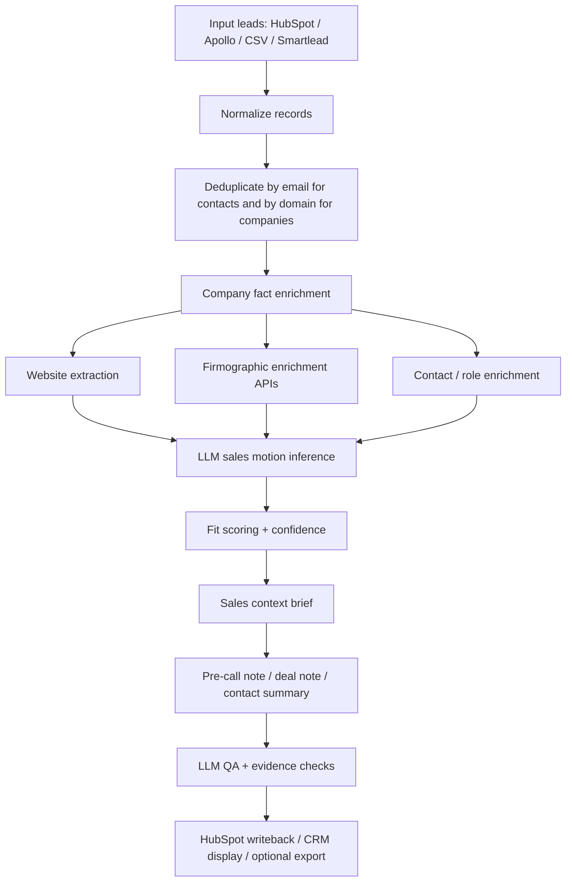

# Sales context enrichment playbook

This is the operating playbook for enriching companies, contacts, and deals so sales reps have useful context before calling, following up, or reviewing pipeline.

The goal is not to collect random facts. The goal is to produce a reliable sales context brief that can be displayed in HubSpot, attached to a contact/deal/company, and reused by SDRs, AEs, founders, or automation.

Cold email copy is only one optional downstream use. The primary output is context: what the company does, how they likely sell, why Vocify may be relevant, what to ask on a call, and which facts are safe enough to mention.

## When To Use This

Use this process when we have a list of contacts, companies, or deals from HubSpot, Apollo, Smartlead, CSV exports, or another source and we need to:

- understand what the company sells;
- infer how their sales team probably works;
- identify whether Vocify is a strong, moderate, weak, or not-applicable fit;
- create pre-call notes for contacts or deals;
- find grounded conversation hooks for calls, manual outreach, or follow-up;
- prepare fields and notes that can be pushed back into HubSpot;
- support future copy generation without hallucinating company facts.

Do not use this process to create a sales note directly from a company name only. Company name alone is too weak and creates generic context.

## Core Principle

The enrichment pipeline has three separate jobs:

1. **Collect facts**: website, CRM/HubSpot fields, Apollo/PDL/Coresignal data, public company profile, funding, headcount, tech stack.
2. **Infer sales motion**: what the sales team likely does every day and how CRM admin becomes painful.
3. **Create sales context brief**: only the facts, hypotheses, questions, and talk tracks that are useful before a sales interaction.

The LLM should never be allowed to blur facts and guesses. Every output field should be either:

- `fact`: directly observed from a source;
- `inference`: likely, but not confirmed;
- `internal_only`: useful for scoring or prioritization but too risky to say to the prospect.

## Current OpenRouter Pattern

Use OpenRouter Chat Completions with JSON mode for LLM steps. OpenRouter supports `response_format: {"type": "json_object"}` and structured outputs for compatible models, but models vary in how well they obey JSON and reasoning parameters.

Recommended request pattern:

```json
{
  "model": "google/gemini-3.1-flash-lite",
  "messages": [
    {"role": "system", "content": "Return only valid JSON."},
    {"role": "user", "content": "{...input...}"}
  ],
  "temperature": 0.1,
  "max_tokens": 3000,
  "response_format": {"type": "json_object"}
}
```

Model notes from our tests:

| Use case | Recommended model | Reasoning |
|---|---|---|
| Bulk enrichment | `google/gemini-3.1-flash-lite` | Cheap, stable enough, good for classification/extraction |
| Normal account/contact notes | `google/gemini-3.1-flash-lite` | Best cheap default tested so far |
| Important account/deal briefs | `google/gemini-3.5-flash` | Better synthesis, more expensive |
| QA / upgrade pass | `google/gemini-3.5-flash` for important records; lite for cheap pass | 3.5 is stricter and more useful |
| Experimental cheap synthesis | `deepseek/deepseek-v4-flash` with no reasoning | Cheap but QA can be noisy |
| Avoid for now | `minimax/minimax-m3`, `z-ai/glm-5.2` for this workflow | Slow, retries, or weaker output |

Important: some models return useful output inside `reasoning` instead of `content` when reasoning is enabled. For DeepSeek Flash, use no reasoning parameter. For Gemini, `reasoning: {"effort": "medium"}` is acceptable when we want quality, but costs more.

## Pipeline Overview



## Step 1: Normalize Input

Normalize every lead into a canonical record before enrichment.

Required lead fields:

```json
{
  "lead_email": "",
  "first_name": "",
  "last_name": "",
  "full_name": "",
  "title": "",
  "linkedin_url": "",
  "company_name": "",
  "company_domain": "",
  "company_linkedin_url": "",
  "source": "hubspot|apollo|smartlead|csv",
  "source_record_id": ""
}
```

Rules:

- Generate contact context per `lead_email` and company context per canonical company domain.
- Enrich company intelligence per canonical company domain.
- Preserve source IDs so the enriched data can be written back to HubSpot later.
- Clean company names before display: remove obvious suffix noise when useful (`GROUP`, `EMEA`, `INC`, `SL`, `S.L.`, all-caps casing), but keep legal names in raw fields.
- Never show all-caps company names in user-facing notes unless that is the actual brand style.

## Step 2: Company Fact Enrichment

The fact layer should gather raw evidence. It should not write copy.

Recommended source priority:

1. Company website and product pages.
2. HubSpot existing properties and lifecycle/deal context.
3. Apollo or other enrichment provider firmographics.
4. LinkedIn/company profile data from licensed APIs.
5. News/funding/technographics sources.
6. LLM inference only after the above facts are collected.

Suggested company fact schema:

```json
{
  "company": {
    "name_raw": "",
    "name_clean": "",
    "domain": "",
    "website_url": "",
    "linkedin_url": "",
    "hq_country": "",
    "hq_city": "",
    "industry": "",
    "employee_count": null,
    "founded_year": null,
    "annual_revenue": null,
    "total_funding": null,
    "latest_funding_round": "",
    "latest_funding_date": "",
    "technologies": [],
    "short_description": ""
  },
  "evidence": [
    {
      "source_type": "website|hubspot|apollo|pdl|coresignal|crunchbase|wappalyzer",
      "source_url": "",
      "field": "",
      "value": "",
      "confidence": "high|medium|low",
      "retrieved_at": ""
    }
  ]
}
```

## Step 3: Website Extraction

For company websites, extract only pages likely to explain the product and sales motion:

- homepage;
- `/solutions`, `/products`, `/services`;
- `/industries`;
- `/customers`, `/case-studies`;
- `/pricing` if public;
- `/about` for founding/location/funding context;
- job pages only if we need sales hiring signals.

Website extraction output:

```json
{
  "website_summary": "",
  "what_they_sell": "",
  "buyer_types": [],
  "sales_motion_clues": [],
  "field_sales_clues": [],
  "inside_sales_clues": [],
  "enterprise_sales_clues": [],
  "account_management_clues": [],
  "safe_copy_hooks": [],
  "safe_call_hooks": [],
  "suggested_discovery_questions": [],
  "unsafe_or_uncertain_claims": []
}
```

Do not scrape logged-in LinkedIn directly. Use public pages where allowed, HubSpot/Apollo data, or licensed providers. Direct LinkedIn scraping is brittle and can create compliance risk.

## Step 4: External Data Sources

Use different APIs for different jobs. Do not expect one API to answer everything.

| Need | Best candidates | Notes |
|---|---|---|
| Company firmographics | Apollo Organization Enrichment, People Data Labs Company Enrichment, Coresignal Company API | Domain/name matching, industry, size, revenue/funding depending provider |
| Contact enrichment | Apollo People Enrichment, People Data Labs Person Enrichment, Coresignal Employee API | Validate role/title/seniority and current company |
| Number of sales reps | People Data Labs `employee_count_by_role` / `employee_count_by_sub_role`, Coresignal employee search/counts, Apollo People Search by company + sales department | Treat as estimate; store source and timestamp |
| Funding/founded/founders | Crunchbase Data, Apollo org enrichment where available, Coresignal/NinjaPear alternatives | Useful for hooks only if recent or strategically relevant |
| Technology stack | Wappalyzer API, BuiltWith, Apollo technologies | Useful for CRM/RevOps context, not always for copy |
| Website/company updates | Company website, blog RSS, Wappalyzer/company updates providers, news APIs | Good for hooks, but avoid stale/irrelevant news |
| Email verification | MillionVerifier, NeverBounce, ZeroBounce | Verification is separate from enrichment |

For sales rep count, the cleanest design is:

```json
{
  "sales_team_estimate": {
    "count": 18,
    "method": "pdl_employee_count_by_role|coresignal_employee_search|apollo_people_search",
    "query": "company_domain + role=sales",
    "confidence": "medium",
    "retrieved_at": "",
    "notes": "Estimate based on public/profile data, not payroll truth."
  }
}
```

Do not put exact sales rep counts in prospect-facing language unless the source is very strong. Use it mostly for prioritization, fit scoring, and internal call prep.

## Step 5: HubSpot Integration

HubSpot should be treated as both an input and a destination.

Input from HubSpot:

- contact email, name, title, LinkedIn URL;
- associated company name/domain;
- associated deals and pipeline stage;
- owner, lifecycle stage, lead source;
- last activity / last contacted;
- exclusion logic: booked meetings, active deals, customers, unsubscribed contacts.

HubSpot enrichment writeback fields should be custom properties, for example:

Company properties:

- `vocify_sales_motion`
- `vocify_crm_pain`
- `vocify_fit`
- `vocify_fit_confidence`
- `vocify_sales_team_estimate`
- `vocify_sales_team_estimate_source`
- `vocify_company_context`
- `vocify_call_hook`
- `vocify_discovery_questions`
- `vocify_enrichment_status`
- `vocify_enriched_at`

Contact properties:

- `vocify_persona`
- `vocify_call_angle`
- `vocify_contact_context`
- `vocify_pre_call_note`
- `vocify_context_status`
- `vocify_do_not_contact_reason`
- `vocify_last_context_refresh_at`

Deal properties or notes:

- `vocify_deal_context`
- `vocify_likely_pain`
- `vocify_relevant_use_case`
- `vocify_next_best_question`
- `vocify_enrichment_sources`

Deal exclusions:

- Exclude contacts associated with deals in stages such as `Meeting Booked`, active opps, customers, churn-sensitive accounts, or manual suppression lists.
- Always resolve associations contact -> company -> deal. A contact can be clean but the company can be active.

## Step 6: LLM Sales Motion Inference

The enrichment LLM should not write cold emails. It should classify the company and produce a sales context brief.

Recommended prompt goal:

> Reason from the company website, description, industry, contact title, HubSpot/deal context, and firmographic fields. Infer how the sales team likely works, whether Vocify fits, what CRM admin pain is plausible, and what a rep should know before calling. Return only JSON. Mark every claim as fact or inference.

Recommended output schema:

```json
{
  "what_they_sell": "",
  "likely_buyer": "",
  "sales_motion": "field_sales|inside_sales|enterprise_ae|sdr_outbound|account_management|partner_channel|low_sales_motion|unknown",
  "sales_motion_reasoning": "",
  "crm_pain": "",
  "vocify_fit": "strong|moderate|weak|not_applicable",
  "fit_reasoning": "",
  "confidence": "high|medium|low",
  "conversation_hooks": [
    {
      "hook": "",
      "source": "",
      "why_it_matters": "",
      "safe_to_say": true
    }
  ],
  "unsafe_claims": [],
  "recommended_channel_frame": "whatsapp|chrome_extension|recorded_call|generic",
  "sales_context_brief": {
    "pre_call_summary": "",
    "likely_relevance": "",
    "talking_points": [],
    "discovery_questions": [],
    "potential_objections": [],
    "avoid_saying": [],
    "internal_notes": []
  }
}
```

Fit scoring:

- `strong`: sales team clearly has high-volume meetings, demos, visits, account updates, SDR/AE workflow, or CRM-heavy pipeline management.
- `moderate`: plausible B2B sales workflow but not enough evidence of CRM pain intensity.
- `weak`: company has sales but the motion is low-frequency, transactional, or unclear.
- `not_applicable`: no meaningful sales team motion, tiny company, consumer-only, marketplace without sales-led motion, or bad data.

Confidence scoring:

- `high`: website and firmographic data agree; sales motion is obvious.
- `medium`: likely from industry/title/context, but not directly stated.
- `low`: sparse website, conflicting data, or generic company description.

## Step 7: Sales Context Brief, Not Copy

The note-generation model should receive a compact brief, not raw noisy data.

Good context input:

```json
{
  "lead": {
    "first_name": "Carlos",
    "title": "Head of Sales Spain"
  },
  "company": {
    "name_clean": "Bookassist",
    "description_safe": "Hotel booking technology provider",
    "country": "Spain"
  },
  "sales_motion": "inside_sales",
  "crm_pain": "After demos or account conversations, the team must choose between updating the CRM properly or moving to the next commercial task.",
  "safe_hook": "They sell booking technology to hotels, so sales conversations likely involve multi-stakeholder buying and follow-up detail.",
  "hubspot_context": {
    "deal_stage": "Meeting scheduled",
    "last_activity": "Outbound call attempt",
    "owner": "BDR"
  },
  "channel_frame": "chrome_extension",
  "confidence": "medium"
}
```

Bad context input:

```json
{
  "company_description": "Huge pasted website text...",
  "all_company_keywords": "...",
  "funding": "maybe raised money...",
  "random_news": "..."
}
```

The context brief should be tight enough that the LLM has no excuse to invent.

Recommended sales context output:

```json
{
  "display_title": "Bookassist - hotel booking tech sales motion",
  "one_line_summary": "Bookassist sells booking technology to hotels, so commercial conversations likely involve demos, follow-up detail, and multiple stakeholders.",
  "why_vocify_might_matter": "If their sales team runs demos or account conversations, CRM friction likely appears after calls when reps need to capture next steps, objections, and account context.",
  "conversation_hooks": [
    "Ask how much context from hotel conversations actually makes it into the CRM.",
    "Ask whether pipeline reviews show only activity or the real reason a hotel opportunity is stuck."
  ],
  "discovery_questions": [
    "After a demo or client call, where does the rep usually capture the real next step?",
    "When you review pipeline, do you see objections and decision process, or just activity?",
    "Is CRM completion more painful for new business, account management, or both?"
  ],
  "likely_pains": [
    "CRM updates after demos/account calls",
    "Incomplete next steps",
    "Pipeline activity without context"
  ],
  "safe_facts": [
    {
      "fact": "Bookassist provides booking technology for hotels.",
      "source": "company website",
      "safe_to_say": true
    }
  ],
  "internal_only": [
    "Sales team size estimate is medium confidence; do not mention exact number."
  ],
  "confidence": "medium"
}
```

## Step 8: Note Generation Strategy

Recommended model routing:

1. Enrich all accounts with `gemini-3.1-flash-lite`.
2. Generate pre-call/context notes directly with `gemini-3.5-flash` for `strong` fit, high-value deals, or strategic accounts.
3. Generate notes with `gemini-3.1-flash-lite` for the rest.
4. Upgrade with `gemini-3.5-flash` only if:
   - `context_status` is `failed` or `needs_review`;
   - the note is empty, generic, or not useful before a call;
   - QA flags invented claims, weak source attribution, irrelevant hooks, or unsafe assumptions;
   - the deal/contact is commercially important.

Do not generate strong fit with lite and then regenerate by default. That wastes time and creates extra output churn.

Note types:

- **Company context note**: stable account summary, what they sell, likely sales motion, why Vocify might matter.
- **Contact pre-call note**: tailored to the person's title, likely priorities, and what to ask them.
- **Deal note**: tied to stage, current opportunity context, blockers, next best question, and CRM pain hypothesis.
- **Cold call prep block**: 20-40 second skim version for reps before calling.

Context guardrails:

- Use source-backed facts first, then clearly marked hypotheses.
- Make notes short enough to be read before a call.
- Include questions a rep can actually ask.
- Prefer "likely" and "worth asking" for inferred sales motions.
- Do not pretend we know their internal CRM process.
- Avoid exact claims like team size, salaries, revenue loss, CRM license cost, or funding unless sourced.
- Avoid fluffy language: transformation, optimize, unlock, revolutionary, seamless.

## Step 9: QA

There are two QA layers.

LLM QA should check:

- no invented facts;
- correct sales motion;
- clear separation between facts and hypotheses;
- useful pre-call context;
- relevant discovery questions;
- source attribution for important facts;
- no overpitching Vocify;
- note is concise enough to display in HubSpot;
- no fake personalization.

Deterministic hard checks should block:

- empty summary;
- missing company/contact identifiers;
- placeholders like `{{company}}` or `{{first_name}}`;
- all-caps company name in displayed note;
- exact employee/sales-rep counts without a source;
- "fact" labels without evidence;
- notes over the display length limit;
- prospect-facing claims marked `internal_only`.

The deterministic layer should not rewrite copy. It only decides whether to retry or mark `needs_review`.

## Step 10: Storage

Store raw data, enriched data, and generated context separately.

Recommended files/tables:

- `raw_leads`: original HubSpot/Apollo/CSV fields.
- `company_facts`: normalized firmographic/website data.
- `company_evidence`: source-by-source facts with URLs and timestamps.
- `sales_motion_enrichment`: LLM inference output.
- `sales_context_briefs`: final compact input to note generation.
- `pre_call_notes`: contact/deal/company notes, model, QA status.
- `hubspot_writebacks`: target object ID, properties updated, note ID, timestamp.

For HubSpot display, keep:

- `vocify_context_summary`
- `vocify_likely_sales_motion`
- `vocify_likely_crm_pain`
- `vocify_conversation_hooks`
- `vocify_discovery_questions`
- `vocify_safe_facts`
- `vocify_internal_notes`
- `vocify_context_confidence`
- `vocify_context_sources`

For HubSpot notes/timeline, write a human-readable note with:

- title;
- 3-5 bullet pre-call summary;
- suggested discovery questions;
- source links;
- timestamp and model used.

## Operational Runbook

Small test for enrichment:

```bash
python3 enrich_sales_motion.py \
  --input-csv leads_normalized.csv \
  --output-csv leads_enriched.csv \
  --company-limit 5
```

Recommended production batch:

```bash
# 1. Enrich all companies cheaply.
python3 enrich_sales_motion.py \
  --input-csv leads_normalized.csv \
  --output-csv leads_enriched.csv

# 2. Generate sales context notes.
# This should be implemented as a dedicated script/service rather than the email generator.
python3 generate_sales_context_notes.py \
  --input-csv leads_enriched.csv \
  --output-jsonl sales_context_notes.jsonl \
  --model google/gemini-3.1-flash-lite

# 3. Upgrade strong fit or strategic deals with a better synthesis model.
python3 generate_sales_context_notes.py \
  --input-csv leads_enriched.csv \
  --output-jsonl sales_context_notes_upgraded.jsonl \
  --model google/gemini-3.5-flash \
  --only-fit strong

# 4. Write fields/notes back to HubSpot.
python3 sync_sales_context_to_hubspot.py \
  --input-jsonl sales_context_notes.jsonl
```

## Data Quality Rules

Use a fact in copy only if:

- it came from a trusted source;
- it is relevant to the sales director;
- it makes the CRM pain more concrete;
- it does not sound like fake personalization.

Examples of good hooks:

- "your team sells to hotels, so follow-up context matters after demos";
- "enterprise cybersecurity deals usually involve technical objections and several stakeholders";
- "field solar sales creates CRM friction after visits";
- "multi-location / multi-country teams make CRM consistency harder."

Examples of bad hooks:

- "you were founded in 2019" when it does not connect to the pain;
- "you raised Series B" unless it implies team growth or sales scaling;
- "you use HubSpot" unless verified and relevant;
- "you have 18 sales reps" unless sourced and used carefully.

## Recommended Next Build

Build the enrichment system as four modules:

1. `lead_normalizer`
   - input: HubSpot/Apollo/CSV/Smartlead;
   - output: canonical lead + company records.

2. `company_researcher`
   - website extraction;
   - external APIs;
   - evidence table.

3. `sales_motion_enricher`
   - LLM inference via OpenRouter;
   - fit scoring;
   - confidence;
   - copy brief.

4. `sequence_generator`
   - model routing;
   - copy generation;
   - QA;
   - export to Smartlead and/or writeback to HubSpot.

This separation matters because enrichment should be reusable. The same company intelligence can power outbound copy, HubSpot account fields, SDR research, and future sales workflows.

## Source References

- OpenRouter API overview: https://openrouter.ai/docs/api_reference/overview
- OpenRouter structured outputs: https://openrouter.ai/docs/guides/features/structured-outputs
- OpenRouter response parameters: https://openrouter.ai/docs/api_reference/parameters
- HubSpot CRM contacts API: https://developers.hubspot.com/docs/api-reference/legacy/crm/objects/contacts/guide
- HubSpot CRM deals API: https://developers.hubspot.com/docs/api-reference/legacy/crm/objects/deals/guide
- HubSpot associations API: https://developers.hubspot.com/docs/api-reference/latest/crm/associations/associate-records/guide
- Apollo organization enrichment: https://docs.apollo.io/reference/organization-enrichment
- Apollo people enrichment: https://docs.apollo.io/reference/people-enrichment
- People Data Labs company enrichment: https://docs.peopledatalabs.com/docs/company-enrichment-api
- People Data Labs employee count fields: https://docs.peopledatalabs.com/docs/employee-count-fields
- Coresignal company/employee/jobs APIs: https://coresignal.com/
- Crunchbase data API: https://data.crunchbase.com/docs/welcome-to-crunchbase-data
- Wappalyzer APIs: https://www.wappalyzer.com/api/
