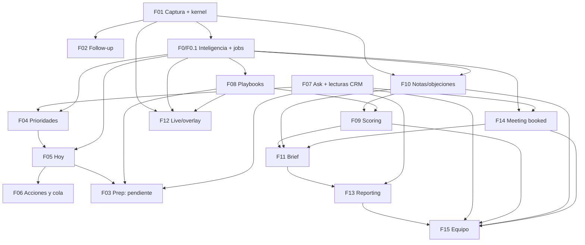

# Vocify V1 — Integración, dependencias y gates de cierre

[Maestro](/Users/danizal/getvocify/proposed_plan.md) · [Contratos](/Users/danizal/getvocify/docs/superpowers/plans/2026-09-22-vocify-v1/00-contracts.md)

**Estado:** planificación. Estos recorridos se ejecutan durante las entregas, no se han probado por escribir este documento. Un gate verde exige evidencia de la aplicación o de la integración correspondiente.

## El orden y el grafo cumplen funciones distintas

Las 16 entregas siguen la secuencia del maestro. Las flechas de este grafo representan dependencia de contratos; no autorización para implementar en paralelo.

F07 reutiliza código existente y puede consultar memos legacy; no requiere por definición un score o un playbook. Aun así se ejecuta en la posición5 acordada. F03 no bloquea ninguna entrega posterior. F12 se ejecuta después de F11 por secuencia, aunque su núcleo depende de captura/evidencia/playbooks, no del brief.

## Dependencias hacia el futuro eliminadas

| Conflicto descubierto al dividir | Resolución canónica | Dónde se prueba |
|---|---|---|
| F01 necesita transcript shared antes del kernel previsto en F02 | F01 adelanta base/tokens/sync de PF; F02 amplía con followup. Un solo origen y un solo CSS. | F01 build/sync y F02 regresión de transcript. |
| Prioridad necesita saber si hay meeting antes de F14 | F0 ya produce `meeting.agreed`; F14 aporta propuesta/validación temporal/escritura posterior. | F04 acuerdo confirmado sin tabla de la migración 046. |
| Hoy necesita objeciones antes de F10 | F0 produce hechos de objeción con resolución; F10 añade notas y proyección persistida, no la primera interpretación. | F05 open/resolved/unknown sin tabla de la migración 044. |
| Reports menciona cierres antes de snapshots de la migración 049 | F13 añade lectura mínima outcomes al proveedor y cobertura en snapshot de la migración 048; F15 añade observaciones históricas de la migración 049. Sin fuente temporal fiable, cierre no disponible. | F13 sin tabla de la migración 049 y F15 preserva informes emitidos. |
| `memo_jobs` no puede representar importaciones o ejecuciones de empresa |040/043/048 conservan su estado/claim de dominio con las mismas garantías; no crear memos falsos ni job polimórfico general. | Claims de cada dominio y recuperación sin cruces. |
| Copilot React no se puede mover como componente a Electron | Núcleo puro compartido y adapters; la página beta permanece como host y el overlay como renderer de estado. | Paridad de fixtures, SSE/cancel, una STT en F12. |
| Casillas de cobertura podían parecer implementación completa | Solo checklist documental del maestro está marcado; planes por entrega tienen tareas abiertas. | Auditoría de integridad del paquete. |

## Unidades de trabajo y propiedad de archivos compartidos

| Recurso | Primer propietario | Cambios posteriores permitidos |
|---|---|---|
| `shared/ui/vocify-ui.css`, tokens, sync | F01 | F02/F06/F03/F14/F12 añaden componentes sin reemplazar reglas previas; check-generated siempre. |
| `backend/app/api/router.py` | Cada feature registra solo su router | No crear segundo prefijo `/api/v1` ni importar módulos aún inexistentes. |
| `backend/app/models/memo.py` y extracción | F01 contexto, F0 inteligencia | F10 notas como fuente; consumidores guardan sus resultados sin volver a interpretar transcript. |
| `crm_providers/protocols.py` | F07 lecturas | F04 asignados; F14 escritura reunión; F13 outcomes. Tests de contrato ambos CRMs al ampliar. |
| `backend/app/services/intelligence/worker.py` | F0/F0.1 | Registrar handlers al entregarlos; no encolar kinds futuros ni bloquear extracción si faltan. |
| `TodayPanel` / DashboardHome | F04 primer acceso; F05 home | F06 acciones, F03 preparación si aprobada. Un solo vacío principal y mismo historial. |
| `api/coaching.py` / bloque revisión | F09 score | F11 brief amplía la misma superficie; F14 comparte revisión existente. |
| `crm_copilot/tools.py` | F07 | F15 añade lecturas equipo por ámbito, no nuevo loop ni bypass. |
| `ResendClient` | Existente, F13 amplía idempotencia opcional | Calls transaccionales existentes conservan firma y comportamiento. |
| Workflow macOS | F01 `.github/workflows/desktop-dmg.yml` | Packaging incorpora nuevos módulos shared sin otro workflow paralelo. |

Toda ruta anterior es relativa al monorepo `/Users/danizal/getvocify`; las citas del repo hermano en la auditoría sirven para localizar código previo a importación. No editar ambos repos como implementaciones divergentes.

## Gates durante cada entrega

| Gate | Preparación y recorrido | Resultado observable | Responsable |
|---|---|---|---|
| G01 Captura durable | Capturar mic/sistema, cortar red, cerrar/reabrir, completar subida dos veces. | Mismo memo, audio recuperado, origen meeting y tiempos reproducibles; provisional no se duplica. | F01 |
| G02 Followup coherente | Abrir revisión, editar, esperar polling, cambiar memo, abrir correo en tres superficies. | Edición protegida, borrador por identidad, copy de apertura honesto. | F02 |
| G03 Evidencia y revisión | Interrumpir worker y completar revisiones A/B fuera de orden. | Una revisión vigente; A nunca sobrescribe B; CRM legacy sigue usable. | F0/F0.1 |
| G04 Proceso publicado | Importar, revisar, publicar y editar mientras hay meeting. | Versión activa válida; captura mantiene snapshot; member no edita. | F08 |
| G05 Chat persistente | POST devuelve202, cerrar/reabrir, confirmar operación, repetir. | Mismo turno y efecto único; voz editable sin memo comercial. | F07 |
| G06 Contacto prioritario | Pain confirmado, historial desconocido y meeting agreed sin F14. | Ranking explicable; ausencia de fuentes no se vuelve nunca llamado. | F04 |
| G07 Hoy reconciliado | Compromiso, tarea CRM, ejecución diaria repetida y fuente caída. | Sin duplicados/resoluciones falsas; cobertura visible. | F05 |
| G08 Acción recuperable | Resolver/undo y409 desde2superficies; buzón con memo. | Estado/version coherentes, foco/animación correctos y cola avanza sin falsa conversación. | F06 |
| G09 Preparación contextual | Solo tras aprobación: extensión contacto A/B, sin historial y captura activa. | Contexto de contacto correcto; no sustituye captura en curso; secundarios iguales. | F03 |
| G10 Nota humana | Nota offline con offset, sync/reextracción y revisión. | Autor/tiempo conservados; no cita falsa de prospecto ni doble patrón. | F10 |
| G11 Score explicable | Criterios desconocidos, playbook ambiguo y outcome cambiado. | Null/cobertura honestos; score no recibe bonus de cierre. | F09 |
| G12 Reunión revisada | Hora corregida, aprobar dos veces y timeout provider. | Una actividad, zona correcta, sin invitación/venta implícita. | F14 |
| G13 Brief disponible | Pendiente mientras empieza otra llamada; parcial/sin audio/retry. | Seis estados correctos, contenido vigente y acceso a evidencia disponible. | F11 |
| G14 Overlay real | Principal minimizada/fullscreen, sugerencia válida y cambio sesión tardío. | Overlay existente, una STT, grounding y tiempos; no roba foco ni muestra sesión anterior. | F12 |
| G15 Informe único | DST, doble job, email falla y lectura por campana. | Snapshot único, email/UI coherentes y permiso reevaluado. | F13 |
| G16 Equipo rastreable | Dos owners, tres contactos, monedas distintas y consulta desde chat/reporte. | Una venta, atribución visible, ratios ponderados y mismo ámbito en tres canales. | F15 |

## Pruebas de contrato entre entregas

No esperar al final para descubrir que productor y consumidor discrepan. Al añadir un consumidor, usar una salida serializada del productor y verificar: versión, identidad, evidencia, nullability y estado parcial. Las fixtures de contrato viven bajo el directorio de tests del consumidor y se obtienen del productor del mismo commit, no se inventan con otra forma.

- F01 → F0/F10/F12: misma captura, reloj y revisión; un offline replay no cambia autor/empresa.
- F0 → F04/F05: meeting agreed y objection resolution disponibles antes de sus interfaces posteriores; datos legacy/unknown no se elevan a certeza.
- F08 → F09/F12: snapshot fijo; publicar una versión no cambia cálculo histórico ni checklist activo.
- F10 → F09/F11: nota humana permanece identificada como nota y una revisión vieja no entra a un score nuevo.
- F09 → F13/F15: conservar numeradores/denominadores/unknown; caso1/1 y1/9 agrega2/10.
- F14 → F13/F15: acuerdo no significa venta; escritura CRM uncertain no se cuenta como actividad creada confirmada.
- F13 → F15: informe personal antiguo no cambia al introducir historia de outcomes; scope team revalida permisos.

## Recorridos completos al integrar varios bloques

### R1 — Reunión a aprendizaje y resultado

Captura F01 → extracción F0 → followup F02 → notas/objeciones F10 → score F09 con playbook F08 → meeting proposal F14 → brief F11 → informe F13 → equipo F15. Se puede activar ayuda F12 durante captura sin sustituir el análisis final.

Probar un camino completo con evidencia compartida y otro con interrupciones: audio parcial, playbook ausente, outcome CRM inaccesible. Cada consumidor tiene que conservar la limitación; ningún agregado «cura» la incertidumbre inventando un valor.

### R2 — Inicio del día a acción

Contexto CRM F07/F04 → Hoy F05 → cola/acciones F06 → nueva captura/interacción → reconciliación F05. F03 enriquece solo si aprobada; su ausencia no impide llamar, revisar ni resolver. Probar un buzón con memo y una conversación conectada: solo la segunda alimenta coaching elegible.

### R3 — Publicación y cambios tardíos

Publicar playbook versión 2 mientras existe meeting con versión 1; terminar jobs A/B en orden inverso; actualizar owner/outcome después de emitir informe. Deben permanecer separados snapshot del meeting, revisión del análisis y snapshot del informe. Conservar trazabilidad en detalle y no recalcular historia silenciosamente.

### R4 — Autorización de extremo a extremo

Member intenta abrir memo de otro ámbito, publicar playbook, leer team API, pedir datos de otra empresa al chat y abrir informe ajeno. Verificar denegación de servidor, limpieza de cache al cambiar sesión y ausencia de datos en respuestas. Ocultar navegación por sí solo no satisface este recorrido.

## Migraciones y activación

La secuencia037–049 y su contenido permanecen en el maestro; no se crean migraciones extra por dividir planes. Cada entrega aplica solo su migración en una base aislada de prueba, comprueba backfill/nullable/índices/RLS y actualiza `backend/full_reset.sql` y `docs/DATABASE_SCHEMA.md`.

Las pruebas de atomicidad necesitan PostgreSQL real de prueba y dos transacciones; mocks de Supabase sirven para errores/contratos pero no demuestran locks ni unicidad. La configuración de base de prueba se prepara durante la entrega sin usar credenciales de producción ni volcar secretos en logs. Si falta acceso necesario, se registra bloqueo y se completan los casos independientes.

Revalidar la última migración antes de ejecutar: si otro trabajo consumió un número reservado, el coordinador reasigna la secuencia completa pendiente y actualiza maestro/planes antes de aplicar nada. No renombrar una migración ya aplicada.

Desplegar backend compatible primero, luego consumidores y flags por empresa. Al fallar, desactivar consumidor y conservar datos/captura/revisión CRM. No eliminar esquema como rollback de una feature. Flag existente `FOLLOWUP_ENABLED` se mantiene; los demás nombres se fijan en config al implementar el consumidor, no se anuncian como settings ya disponibles.

## Dossier de salida y suspensión

Cada entrega devuelve spec, decisiones, inventario de cambios, migraciones, comandos/resultados, veredictos reales y bloqueos. El coordinador registra contrato producido/revisión aceptada antes de habilitar consumidores. Un test fallido vuelve al implementador, no se declara bloqueo de producto.

Una suspensión por F03, Developer ID u otro acceso externo deja criterios abiertos. Solo puede avanzarse a implementación independiente después de documentar que no consume esa parte y que no hay dos implementaciones simultáneas. Preparar el próximo plan sin tocar su código sí puede hacerse durante la espera. No completar una entrega por haber llegado al final de este documento.

## Verificación de esta planificación

Al cerrar la edición documental se comprueba:16 planes,15 specs funcionales conservadas, todos los criterios originales presentes, migraciones y pruebas base preservadas, links locales válidos, dependencias acíclicas y tareas abiertas. No se ejecuta Reticle ni se afirma que la aplicación funciona por validar Markdown.
